# 데이터 처리 파이프라인 순서도

```mermaid
flowchart LR
    Start([Step 1: 원본 데이터 로드<br/>df_raw])
    Start --> LoadCSV{CSV 파일 업로드?}
    LoadCSV -->|Yes| Upload[업로드된 파일 읽기<br/>pd.read_csv]
    LoadCSV -->|No| Default[기본 파일 사용<br/>fitc_peptide_timeseries.csv]
    Upload --> UnitStd
    Default --> UnitStd
    
    UnitStd[Step 2: 단위 표준화<br/>UnitStandardizer]
    UnitStd --> StdTime[2-1. Time 표준화<br/>time_min → time_s<br/>min × 60 = s]
    UnitStd --> StdFluor[2-2. Fluorescence 표준화<br/>RFU → FL_intensity<br/>컬럼 선택만]
    UnitStd --> StdConc[2-3. Concentration 표준화<br/>질량 농도 → 몰 농도]
    
    StdTime --> StdFluor
    StdFluor --> StdConc
    
    StdConc -->|μg/mL or ng/mL| Mass2Molar[질량 농도 → 몰 농도 변환<br/>MW 사용]
    StdConc -->|이미 uM or nM| KeepMolar[그대로 유지]
    Mass2Molar --> Normalize
    KeepMolar --> Normalize
    
    Normalize[Step 3: 정규화<br/>두 단계로 진행]
    
    Normalize --> TempNorm[Step 3-1: 임시 정규화<br/>Model-free Threshold]
    TempNorm --> GroupBy1[농도별 그룹화]
    GroupBy1 --> TempF0[F0_temp = 최소 형광값<br/>min F]
    TempF0 --> TempFmax[Fmax_temp = 최대 형광값<br/>max F]
    TempFmax --> CalcAlphaTemp[α_temp 계산<br/>F - F0_temp / Fmax_temp - F0_temp]
    CalcAlphaTemp --> NextConc1{다음 농도?}
    NextConc1 -->|Yes| TempF0
    NextConc1 -->|No| MergeTemp[임시 정규화 완료]
    
    MergeTemp --> DivideRegions[Step 4: 구간 구분<br/>RegionDivider.divide_regions]
    
    DivideRegions --> Region1[초기 선형 구간<br/>Initial Linear Region]
    DivideRegions --> Region2[지수 증가 구간<br/>Exponential Growth Region]
    DivideRegions --> Region3[Plateau 구간<br/>Plateau Region]
    
    Region1 --> FinalNorm
    Region2 --> FinalNorm
    Region3 --> FinalNorm
    
    FinalNorm[Step 3-2: 최종 정규화<br/>Region-based]
    FinalNorm --> GroupBy2[농도별 그룹화]
    GroupBy2 --> FinalF0[F0 = F0_temp<br/>최소값 유지]
    FinalF0 --> CheckPlateau{Plateau 구간<br/>존재?}
    
    CheckPlateau -->|Yes| PlateauAvg[Fmax = Plateau 평균<br/>mean F_plateau]
    CheckPlateau -->|No| CheckExp{지수 증가 구간<br/>충분?}
    
    CheckExp -->|Yes >= 3점| FitExp[지수 함수 피팅<br/>F∞ = F0 + A]
    CheckExp -->|No| FallbackMax[Fmax = 최대값<br/>max F]
    
    FitExp --> CalcAlphaFinal
    PlateauAvg --> CalcAlphaFinal
    FallbackMax --> CalcAlphaFinal
    
    CalcAlphaFinal[α = F - F0 / Fmax - F0<br/>최종 alpha 계산]
    CalcAlphaFinal --> NextConc2{다음 농도?}
    NextConc2 -->|Yes| FinalF0
    NextConc2 -->|No| MergeFinal[최종 정규화 완료]
    
    MergeFinal --> CheckIter{반복 횟수<br/>충분?}
    CheckIter -->|No| DivideRegions
    CheckIter -->|Yes| End([최종 데이터<br/>df 반환])
    
    style Start fill:#e1f5ff
    style End fill:#d4edda
    style Normalize fill:#fff3cd
    style ExpFit fill:#ffeaa7
    style CalcFmax fill:#fdcb6e
    style CalcAlpha fill:#6c5ce7
```

## 주요 단계 설명

### Step 1: 데이터 로드
- CSV 파일 업로드 또는 기본 파일 사용
- `pd.read_csv()`로 원본 데이터 로드

### Step 2: 단위 표준화 (UnitStandardizer)
- **2-1. Time 표준화**: `time_min` → `time_s` (min × 60)
- **2-2. Fluorescence 표준화**: `RFU` → `FL_intensity` (컬럼 선택만)
- **2-3. Concentration 표준화**: 
  - 질량 농도 (`μg/mL`, `ng/mL`) → 몰 농도 (`μM`, `nM`)
  - 분자량(MW) 사용하여 변환
  - 이미 몰 농도면 그대로 유지

### Step 3: 정규화 (DataNormalizer) - 두 단계로 진행

#### Step 3-1: 임시 정규화 (Model-free Threshold)
- **방법**: 단순 threshold 방식
- **F0_temp**: 각 농도별 최소 형광값 (`min(F)`)
- **Fmax_temp**: 각 농도별 최대 형광값 (`max(F)`)
- **임시 alpha**: α_temp = (F - F0_temp) / (Fmax_temp - F0_temp)
- **목적**: Step 4 구간 구분을 위한 초기 정규화

#### Step 3-2: 최종 정규화 (Region-based)
- **F0**: F0_temp와 동일 (최소값 유지)
- **Fmax 결정 우선순위**:
  1. **Plateau 구간 존재 시**: Plateau 구간의 평균 형광값 사용
     - `Fmax = mean(F_plateau)`
  2. **Plateau 없고 지수 증가 구간 충분 시**: 지수 함수 피팅으로 F∞ 추정
     - 지수 증가 구간에 대해 F(t) = F₀ + A·(1 - e^(-k·t)) 피팅
     - `Fmax = F₀ + A` (F∞)
  3. **그 외**: 최대값 사용 (fallback)
- **최종 alpha**: α = (F - F0) / (Fmax - F0)
- **메타데이터**:
  - `F0`: 최종 F0 값
  - `Fmax`: 최종 Fmax 값
  - `Fmax_method`: Fmax 결정 방법 (`plateau_mean`, `exponential_Finf`, `fallback_max`)

### Step 4: 구간 구분 (RegionDivider)
- 정규화된 데이터를 3개 구간으로 분류:
  1. **초기 선형 구간** (Initial Linear Region)
  2. **지수 증가 구간** (Exponential Growth Region)
  3. **Plateau 구간** (Plateau Region)
- 각 데이터 포인트에 `region` 컬럼 추가
- **Note**: 구체적인 구분 로직은 추후 구현 예정

### 반복 프로세스
- **최종 정규화 → 구간 구분** 루프가 반복됨 (최소 2번)
- 각 반복에서:
  1. 현재 정규화 상태로 구간 재구분
  2. 새로운 구간 정보로 Fmax 재계산 및 최종 정규화
- 반복 횟수는 사용자가 설정 가능 (기본값: 2회, 최대 10회)
- 반복을 통해 구간 구분과 정규화가 서로 개선되며 수렴

